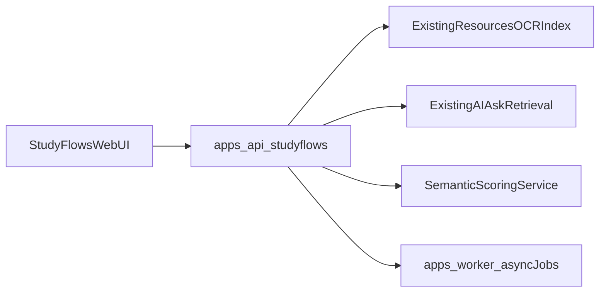

# Post-Linux-Beta Roadmap (Next 2 Weeks)

Date (UTC): 2026-09-08  
Basis: [`linux-beta-gap-log.md`](linux-beta-gap-log.md) + solo acceptance pass

## Decision gate

Linux MVP beta is **ready for daily solo use**.

- StudyFlows entry: **thin prototype next** (not full v1 milestone yet)
- iOS/TestFlight: remain deferred until StudyFlows thin slice feels good on Linux

## Ranked implementation queue

### P0 — Keep beta reliable (1–2 days)

1. Commit/land current Linux beta stability set:
   - migration `0018`, upload MIME fallback, enqueue-after-queued-commit
   - lifecycle row lock, worker rollback-on-error
   - web compose node_modules isolation + `.dockerignore`
   - content-state a11y fix, beta docs
2. Document API ergonomics clearly in README:
   - `/ai/ask` body field is `message`
   - note page create/update field is `text`
3. Add a one-liner cleanup helper for root-owned Docker artifacts (`data/uploads`, `.next`)

### P1 — Quality polish from beta (2–4 days)

1. UI banner when `OPENAI_API_KEY` missing (ask + study lab)
2. Optional request aliases: accept `question`→`message`, `extracted_text`→`text` (compat)
3. Soft data cleanup: “reset demo data” or seed isolation so e2e courses do not clutter solo use
4. Chunk read API: optional full text for selected chunk (needed by StudyFlows highlights)

### P2 — StudyFlows thin prototype (about 1 week)

Goal: prove the learning loop on Linux web before mobile packaging.

Minimum slice:

1. **Capture**: upload textbook photo/PDF page already partly exists; add image OCR path UX in a StudyFlows screen
2. **Explain**: select/highlight a span → agent explanation grounded in that span + nearby context
3. **Recall**: hide a paragraph → typed summary from memory → semantic score (not verbatim)
4. **Review**: generate 3–5 concept flashcards → typed answer → meaning score

Suggested templates (research-backed defaults, user-customizable later):

- Retrieval practice loop
- Explain-then-recall (elaborative interrogation)
- Spaced flashcard follow-up

Architecture fit:

Out of thin prototype scope:

- verbal/voice scoring
- full workflow builder marketplace
- iPad native gestures / TestFlight distribution

### P3 — After thin StudyFlows feels good

1. Persist flow templates + run history
2. Spaced repetition scheduling
3. Voice answer capture + scoring
4. Resume iOS/TestFlight track (Apple secrets + hosted `CAP_SERVER_URL`)

## Explicit non-goals for the next 2 weeks

- Production ship-gate closeout (restore drill / immutable image tags) unless needed for hosted CAP URL
- Canvas / Gradescope integrations
- Native iOS client beyond Capacitor shell

## Success criteria for StudyFlows thin prototype

- User can complete one end-to-end study session on Linux in under 10 minutes
- Scoring rejects verbatim memorization and rewards conceptual coverage
- At least one suggested workflow template is usable without configuration
- No regression in current Linux beta acceptance checklist
